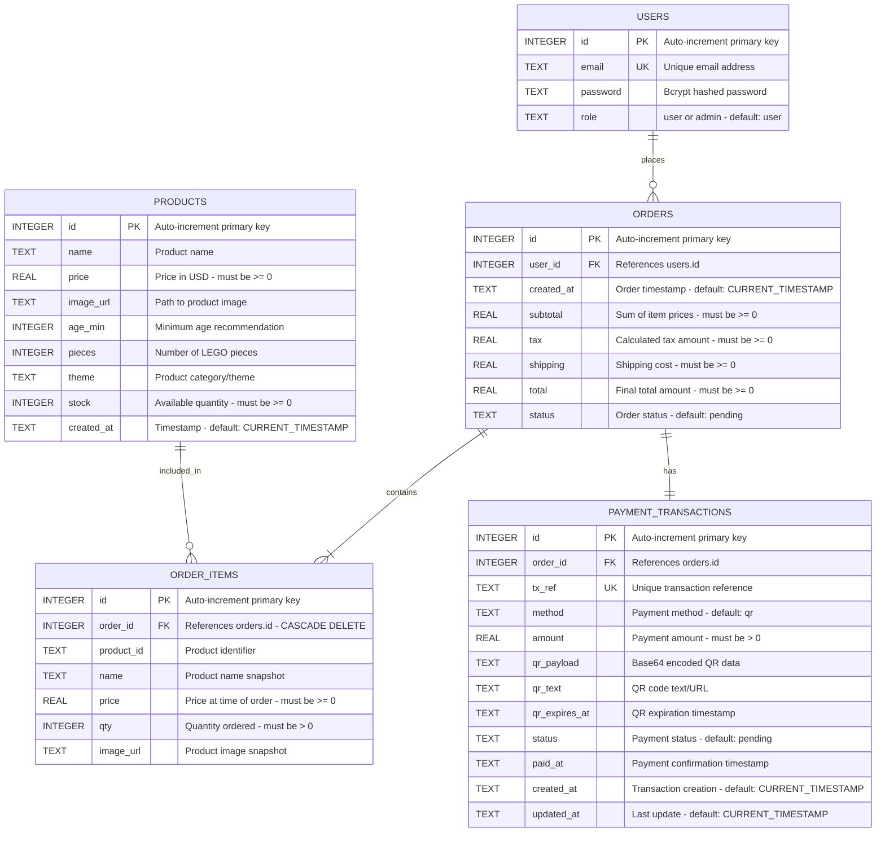

# PLAYARENA - Complete Entity-Relationship Diagram (ERD)

## Database Schema Overview

This document provides the complete ERD for the PLAYARENA e-commerce system, including all entities, relationships, and architectural explanations.

---

## 1. Mermaid ERD Code



---

## 2. Entity Details

### 2.1 USERS Entity

**Purpose**: Stores user authentication and authorization data

**Attributes**:
- `id` (PK): Unique identifier for each user
- `email` (UK): User's email address (used for login)
- `password`: Bcrypt hashed password (never stored in plain text)
- `role`: User role for access control (`user` or `admin`)

**Constraints**:
- `email` must be UNIQUE
- `role` must be either 'user' or 'admin'
- Default role is 'user'

**Indexes**:
- `idx_users_email` on `email` for fast login lookups

**Business Rules**:
- Email must be valid format
- Password must be hashed with bcrypt (10 rounds)
- Admin users have full system access
- Regular users can only access their own data

---

### 2.2 PRODUCTS Entity

**Purpose**: Stores product catalog information

**Attributes**:
- `id` (PK): Unique product identifier
- `name`: Product name/title
- `price`: Product price in USD
- `image_url`: Path to product image file
- `age_min`: Minimum recommended age
- `pieces`: Number of LEGO pieces in set
- `theme`: Product category (e.g., "Classic", "Technic", "City")
- `stock`: Available inventory quantity
- `created_at`: Product creation timestamp

**Constraints**:
- `price` must be >= 0
- `age_min` must be >= 0
- `pieces` must be >= 0
- `stock` must be >= 0

**Indexes**:
- `idx_products_created` on `created_at DESC` for newest products
- `idx_products_stock` on `stock` for low stock queries

**Business Rules**:
- Stock is decremented when payment is confirmed
- Products with stock <= 10 trigger low stock alerts
- Products can be soft-deleted (not implemented) or hard-deleted

---

### 2.3 ORDERS Entity

**Purpose**: Stores order header information

**Attributes**:
- `id` (PK): Unique order identifier
- `user_id` (FK): References the user who placed the order
- `created_at`: Order creation timestamp
- `subtotal`: Sum of all item prices (before tax and shipping)
- `tax`: Calculated tax amount (8% of subtotal)
- `shipping`: Shipping cost ($10 flat rate, free over $100)
- `total`: Final amount (subtotal + tax + shipping)
- `status`: Current order status

**Constraints**:
- `user_id` must reference valid user
- All monetary values must be >= 0
- `status` must be one of: pending, processing, confirmed, shipped, completed, cancelled

**Status Flow**:
```
pending → processing → confirmed → shipped → completed
   ↓
cancelled (can happen at any stage before shipped)
```

**Indexes**:
- `idx_orders_user` on `user_id` for user order history
- `idx_orders_status` on `status` for admin filtering

**Business Rules**:
- Orders start in 'pending' status
- Orders move to 'confirmed' when payment is verified
- Only confirmed orders decrement product stock
- Users can only view their own orders
- Admins can view and manage all orders

---

### 2.4 ORDER_ITEMS Entity

**Purpose**: Stores individual line items for each order (order details)

**Attributes**:
- `id` (PK): Unique order item identifier
- `order_id` (FK): References parent order
- `product_id`: Product identifier (stored as TEXT for flexibility)
- `name`: Product name at time of order (snapshot)
- `price`: Product price at time of order (snapshot)
- `qty`: Quantity ordered
- `image_url`: Product image at time of order (snapshot)

**Constraints**:
- `order_id` must reference valid order
- `price` must be >= 0
- `qty` must be > 0
- CASCADE DELETE: When order is deleted, all items are deleted

**Indexes**:
- `idx_order_items_order` on `order_id` for order detail queries

**Business Rules**:
- Stores snapshot of product data (name, price, image) at order time
- This prevents historical orders from changing if product is updated/deleted
- Quantity must be validated against available stock before order creation
- Total item cost = price × qty

**Why Snapshot Data?**
- Product prices may change over time
- Products may be deleted
- Order history must remain accurate and immutable
- Allows viewing exact order details as they were at purchase time

---

### 2.5 PAYMENT_TRANSACTIONS Entity

**Purpose**: Stores payment transaction details and QR code data

**Attributes**:
- `id` (PK): Unique transaction identifier
- `order_id` (FK): References the order being paid
- `tx_ref` (UK): Unique transaction reference (e.g., "TX-a1b2c3d4e5f6")
- `method`: Payment method (currently only 'qr')
- `amount`: Payment amount (should match order total)
- `qr_payload`: Base64 encoded payment data
- `qr_text`: QR code text/deep link
- `qr_expires_at`: QR code expiration timestamp (30 minutes)
- `status`: Payment status
- `paid_at`: Timestamp when payment was confirmed
- `created_at`: Transaction creation timestamp
- `updated_at`: Last update timestamp

**Constraints**:
- `order_id` must reference valid order
- `tx_ref` must be UNIQUE
- `amount` must be > 0
- `status` must be one of: pending, processing, paid, failed, cancelled

**Status Flow**:
```
pending → processing → paid
   ↓
failed / cancelled
```

**Indexes**:
- `idx_payment_tx_ref` on `tx_ref` for payment confirmation lookups
- `idx_payment_order` on `order_id` for order payment queries

**Business Rules**:
- One payment transaction per order (1:1 relationship)
- Transaction reference is generated server-side
- QR code expires after 30 minutes
- Payment confirmation triggers stock decrement
- Only 'pending' transactions can be confirmed
- Already 'paid' transactions return success without changes

---

## 3. Relationships Explained

### 3.1 USERS ||--o{ ORDERS (One-to-Many)

**Relationship**: One user can place many orders

**Cardinality**: 
- One user (1) → Zero or many orders (0..*)
- One order (1) → Exactly one user (1)

**Foreign Key**: `orders.user_id` → `users.id`

**Why This Relationship Exists**:
- Users need to track their order history
- System needs to know who placed each order
- Enables user-specific order queries
- Required for authorization (users can only view their own orders)
- Supports customer relationship management

**Business Logic**:
- When user logs in, they can view all their orders
- Admin can view orders for any user
- Order history is preserved even if user account is deleted (in production, use soft delete)

**SQL Example**:
```sql
-- Get all orders for a specific user
SELECT * FROM orders WHERE user_id = ?

-- Get user details for an order
SELECT u.email, o.* 
FROM orders o 
JOIN users u ON o.user_id = u.id 
WHERE o.id = ?
```

---

### 3.2 ORDERS ||--|{ ORDER_ITEMS (One-to-Many)

**Relationship**: One order contains many order items

**Cardinality**:
- One order (1) → One or many items (1..*)
- One order item (1) → Exactly one order (1)

**Foreign Key**: `order_items.order_id` → `orders.id` (CASCADE DELETE)

**Why This Relationship Exists**:
- Orders typically contain multiple products
- Separates order header (totals, status) from line items (products, quantities)
- Enables flexible order composition
- Supports order detail views
- Allows individual item tracking

**CASCADE DELETE**:
- When an order is deleted, all its items are automatically deleted
- Maintains referential integrity
- Prevents orphaned order items

**Business Logic**:
- Order must have at least one item
- Each item stores product snapshot (name, price, image)
- Item subtotal = price × qty
- Order subtotal = sum of all item subtotals

**SQL Example**:
```sql
-- Get all items for an order
SELECT * FROM order_items WHERE order_id = ?

-- Get order with items
SELECT o.*, oi.name, oi.price, oi.qty
FROM orders o
JOIN order_items oi ON o.id = oi.order_id
WHERE o.id = ?
```

---

### 3.3 PRODUCTS ||--o{ ORDER_ITEMS (One-to-Many)

**Relationship**: One product can appear in many order items

**Cardinality**:
- One product (1) → Zero or many order items (0..*)
- One order item (1) → Exactly one product (1)

**Foreign Key**: `order_items.product_id` → `products.id` (Logical, not enforced)

**Why This Relationship Exists**:
- Tracks which products are being ordered
- Enables sales analytics (most popular products)
- Supports inventory management
- Allows product performance tracking

**Why Not Enforced FK?**:
- Product data is snapshotted in order_items
- Products can be deleted without affecting historical orders
- Provides data flexibility
- Maintains order history integrity

**Business Logic**:
- When order is created, product details are copied to order_items
- When payment is confirmed, product stock is decremented
- Product deletion doesn't affect past orders
- Can track total sales per product

**SQL Example**:
```sql
-- Get all orders containing a specific product
SELECT o.*, oi.qty
FROM orders o
JOIN order_items oi ON o.id = oi.order_id
WHERE oi.product_id = ?

-- Get product sales statistics
SELECT product_id, name, SUM(qty) as total_sold
FROM order_items
GROUP BY product_id, name
ORDER BY total_sold DESC
```

---

### 3.4 ORDERS ||--|| PAYMENT_TRANSACTIONS (One-to-One)

**Relationship**: One order has exactly one payment transaction

**Cardinality**:
- One order (1) → Exactly one payment (1)
- One payment (1) → Exactly one order (1)

**Foreign Key**: `payment_transactions.order_id` → `orders.id`

**Why This Relationship Exists**:
- Every order requires payment
- Tracks payment status separately from order status
- Stores payment-specific data (QR codes, transaction references)
- Enables payment reconciliation
- Supports payment gateway integration

**Why One-to-One?**:
- Current system: One payment method per order
- Simplifies payment tracking
- Each order has unique transaction reference
- Future enhancement: Could become one-to-many for split payments

**Business Logic**:
- Payment transaction created when order is created
- Transaction reference is unique across all payments
- Payment confirmation updates both payment and order status
- QR code data is stored for reference
- Payment amount must match order total

**SQL Example**:
```sql
-- Get payment details for an order
SELECT p.* 
FROM payment_transactions p
WHERE p.order_id = ?

-- Get order with payment status
SELECT o.*, p.status as payment_status, p.tx_ref
FROM orders o
LEFT JOIN payment_transactions p ON o.id = p.order_id
WHERE o.id = ?

-- Find payment by transaction reference
SELECT p.*, o.total
FROM payment_transactions p
JOIN orders o ON p.order_id = o.id
WHERE p.tx_ref = ?
```

---

## 4. Database Indexes

### Purpose of Indexes
Indexes improve query performance by creating fast lookup structures.

### Implemented Indexes

```sql
-- User lookups (login)
CREATE INDEX idx_users_email ON users(email);

-- Product queries (newest first, low stock)
CREATE INDEX idx_products_created ON products(created_at DESC);
CREATE INDEX idx_products_stock ON products(stock);

-- Order queries (user history, status filtering)
CREATE INDEX idx_orders_user ON orders(user_id);
CREATE INDEX idx_orders_status ON orders(status);

-- Order item queries (order details)
CREATE INDEX idx_order_items_order ON order_items(order_id);

-- Payment queries (confirmation, order payment)
CREATE INDEX idx_payment_tx_ref ON payment_transactions(tx_ref);
CREATE INDEX idx_payment_order ON payment_transactions(order_id);
```

### Performance Impact
- Login queries: O(log n) instead of O(n)
- Order history: Fast user-specific queries
- Payment confirmation: Instant transaction lookup
- Admin dashboard: Fast status filtering

---

## 5. Data Integrity Rules

### Referential Integrity

1. **USERS → ORDERS**
   - Cannot delete user if they have orders (in production)
   - Current: No FK constraint (allows user deletion)
   - Recommendation: Add ON DELETE RESTRICT or use soft delete

2. **ORDERS → ORDER_ITEMS**
   - CASCADE DELETE: Deleting order removes all items
   - Maintains data consistency
   - Prevents orphaned records

3. **ORDERS → PAYMENT_TRANSACTIONS**
   - Cannot delete order if payment exists (in production)
   - Current: No explicit constraint
   - Recommendation: Add ON DELETE RESTRICT

4. **PRODUCTS → ORDER_ITEMS**
   - No FK constraint (intentional)
   - Allows product deletion without affecting orders
   - Historical data preserved

### Check Constraints

```sql
-- Monetary values must be non-negative
CHECK(price >= 0)
CHECK(subtotal >= 0)
CHECK(tax >= 0)
CHECK(shipping >= 0)
CHECK(total >= 0)
CHECK(amount > 0)

-- Quantities must be positive
CHECK(qty > 0)
CHECK(stock >= 0)

-- Age must be non-negative
CHECK(age_min >= 0)
CHECK(pieces >= 0)

-- Enum constraints
CHECK(role IN ('user', 'admin'))
CHECK(status IN ('pending', 'processing', 'confirmed', 'shipped', 'completed', 'cancelled'))
CHECK(status IN ('pending', 'processing', 'paid', 'failed', 'cancelled'))
```

---

## 6. Transaction Management

### Critical Transactions

#### 6.1 Order Creation Transaction
```sql
BEGIN TRANSACTION;

-- 1. Create order
INSERT INTO orders (...) VALUES (...);

-- 2. Create order items
INSERT INTO order_items (...) VALUES (...);

-- 3. Create payment transaction
INSERT INTO payment_transactions (...) VALUES (...);

COMMIT;
-- If any step fails, ROLLBACK
```

**Why Transactional?**
- Ensures atomicity: All or nothing
- Prevents partial orders
- Maintains data consistency
- Rollback on any error

#### 6.2 Payment Confirmation Transaction
```sql
BEGIN TRANSACTION;

-- 1. Verify stock availability
SELECT stock FROM products WHERE id IN (...);

-- 2. Update payment status
UPDATE payment_transactions SET status = 'paid', paid_at = NOW() WHERE id = ?;

-- 3. Update order status
UPDATE orders SET status = 'confirmed' WHERE id = ?;

-- 4. Decrement product stock
UPDATE products SET stock = stock - ? WHERE id = ?;

COMMIT;
-- If any step fails, ROLLBACK
```

**Why Transactional?**
- Prevents overselling (stock check + decrement)
- Ensures payment and order status sync
- Maintains inventory accuracy
- Rollback if insufficient stock

---

## 7. Architecture Explanation

### 7.1 Database Design Pattern

**Pattern**: Normalized Relational Database (3NF)

**Normalization Level**: Third Normal Form (3NF)
- No repeating groups (1NF) ✓
- No partial dependencies (2NF) ✓
- No transitive dependencies (3NF) ✓

**Benefits**:
- Eliminates data redundancy
- Ensures data integrity
- Simplifies updates
- Reduces storage space

**Trade-offs**:
- Requires JOINs for complex queries
- Slightly more complex queries
- Acceptable for OLTP systems

### 7.2 Data Snapshot Pattern

**Implementation**: ORDER_ITEMS stores product snapshots

**Why?**
- Product prices change over time
- Products may be deleted
- Order history must be immutable
- Regulatory compliance (accurate receipts)

**Example**:
```
Product #123: "LEGO Technic Car" - $150 (today)
Order from 2025: Shows $120 (price at that time)
```

### 7.3 Soft Delete vs Hard Delete

**Current**: Hard delete (actual deletion)

**Recommendation for Production**: Soft delete
```sql
ALTER TABLE products ADD COLUMN deleted_at TEXT;
ALTER TABLE users ADD COLUMN deleted_at TEXT;

-- Instead of DELETE
UPDATE products SET deleted_at = CURRENT_TIMESTAMP WHERE id = ?;

-- Queries exclude deleted
SELECT * FROM products WHERE deleted_at IS NULL;
```

**Benefits**:
- Data recovery possible
- Audit trail maintained
- Historical references preserved
- Compliance with data retention policies

### 7.4 Audit Trail

**Current**: Basic timestamps (created_at, updated_at)

**Enhancement for Production**:
```sql
CREATE TABLE audit_log (
  id INTEGER PRIMARY KEY,
  table_name TEXT,
  record_id INTEGER,
  action TEXT, -- INSERT, UPDATE, DELETE
  old_values TEXT, -- JSON
  new_values TEXT, -- JSON
  user_id INTEGER,
  timestamp TEXT DEFAULT CURRENT_TIMESTAMP
);
```

### 7.5 Scalability Considerations

**Current**: SQLite (single file, embedded)

**For Production Scale**:

1. **Database Migration**: SQLite → PostgreSQL/MySQL
   - Better concurrency
   - Advanced features (full-text search, JSON columns)
   - Replication support
   - Better performance at scale

2. **Caching Layer**: Redis
   - Cache product catalog
   - Cache user sessions
   - Rate limiting
   - Real-time inventory

3. **Read Replicas**:
   - Master for writes
   - Replicas for reads
   - Load balancing

4. **Sharding** (if needed):
   - Shard by user_id
   - Shard by region
   - Shard by date

### 7.6 Security Considerations

**Implemented**:
- ✓ Password hashing (bcrypt)
- ✓ Parameterized queries (SQL injection prevention)
- ✓ JWT token authentication
- ✓ Role-based access control

**Additional Recommendations**:
- Add rate limiting (prevent brute force)
- Add email verification
- Add two-factor authentication (2FA)
- Add password reset functionality
- Add session management
- Add IP whitelisting for admin
- Add encryption at rest
- Add SSL/TLS for data in transit

---

## 8. Query Patterns

### 8.1 Common Queries

**Get User Orders**:
```sql
SELECT o.*, 
       COUNT(oi.id) as item_count,
       p.status as payment_status
FROM orders o
LEFT JOIN order_items oi ON o.id = oi.order_id
LEFT JOIN payment_transactions p ON o.id = p.order_id
WHERE o.user_id = ?
GROUP BY o.id
ORDER BY o.created_at DESC;
```

**Get Order Details**:
```sql
SELECT o.*,
       u.email as customer_email,
       p.tx_ref, p.status as payment_status,
       oi.name, oi.price, oi.qty, oi.image_url
FROM orders o
JOIN users u ON o.user_id = u.id
LEFT JOIN payment_transactions p ON o.id = p.order_id
LEFT JOIN order_items oi ON o.id = oi.order_id
WHERE o.id = ?;
```

**Low Stock Products**:
```sql
SELECT * 
FROM products 
WHERE stock <= 10 AND stock > 0
ORDER BY stock ASC;
```

**Sales Report**:
```sql
SELECT 
  oi.product_id,
  oi.name,
  COUNT(DISTINCT oi.order_id) as order_count,
  SUM(oi.qty) as total_quantity,
  SUM(oi.price * oi.qty) as total_revenue
FROM order_items oi
JOIN orders o ON oi.order_id = o.id
WHERE o.status = 'completed'
GROUP BY oi.product_id, oi.name
ORDER BY total_revenue DESC;
```

---

## 9. Summary

### Database Statistics
- **5 Tables**: users, products, orders, order_items, payment_transactions
- **4 Relationships**: 3 one-to-many, 1 one-to-one
- **8 Indexes**: Optimized for common queries
- **15+ Constraints**: Data integrity enforcement
- **2 Critical Transactions**: Order creation, payment confirmation

### Design Principles
✓ **Normalization**: 3NF for data integrity  
✓ **Referential Integrity**: Foreign keys with appropriate constraints  
✓ **Data Snapshots**: Immutable order history  
✓ **Transactional Safety**: ACID compliance  
✓ **Performance**: Strategic indexing  
✓ **Security**: Hashed passwords, parameterized queries  
✓ **Scalability**: Clean design ready for migration  

### Architecture Strengths
- Clean separation of concerns
- Flexible product catalog
- Immutable order history
- Comprehensive payment tracking
- Role-based access control
- Audit-friendly timestamps

### Future Enhancements
- Soft delete implementation
- Audit log table
- Database migration to PostgreSQL
- Caching layer (Redis)
- Full-text search
- Advanced analytics tables
- Customer reviews/ratings
- Product categories (many-to-many)
- Shipping addresses table
- Payment methods table (multiple payment options)

---

**Document Version**: 1.0  
**Last Updated**: 2026-05-14  
**Database Version**: SQLite 3  
**Schema Version**: 2.0 (Refactored)
