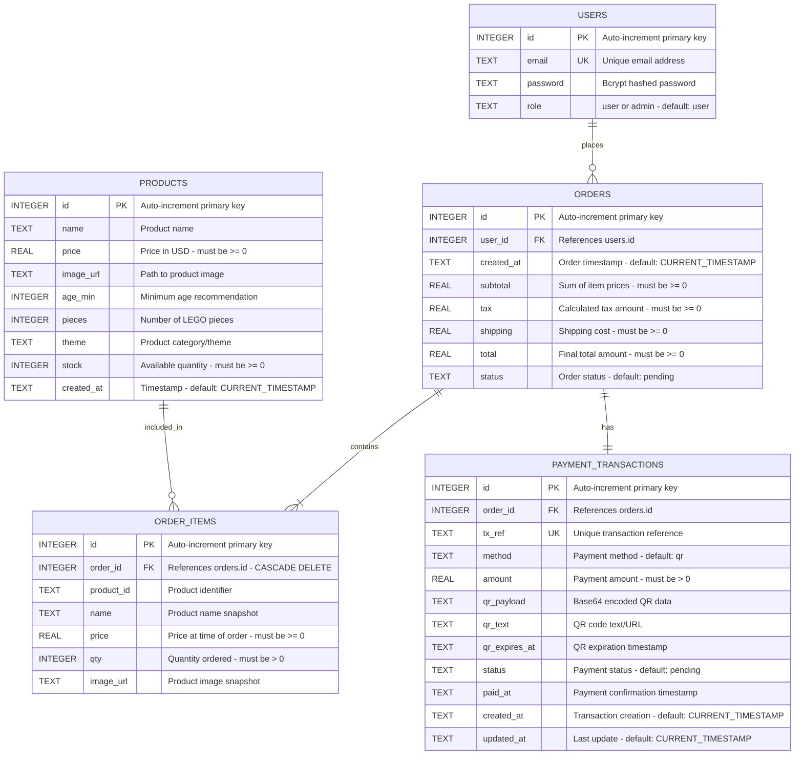

# PLAYARENA - ERD Quick Reference

## 1. Complete Mermaid ERD



---

## 2. Relationships Summary

### 2.1 USERS → ORDERS (One-to-Many)
**Cardinality**: `1 user : 0..* orders`

**Why**: 
- Users can place multiple orders over time
- Each order belongs to exactly one user
- Enables order history tracking
- Required for user-specific queries and authorization

**Foreign Key**: `orders.user_id` → `users.id`

---

### 2.2 ORDERS → ORDER_ITEMS (One-to-Many)
**Cardinality**: `1 order : 1..* items`

**Why**:
- Orders typically contain multiple products
- Separates order header (totals, status) from line items
- Enables flexible order composition
- Supports detailed order views

**Foreign Key**: `order_items.order_id` → `orders.id` (CASCADE DELETE)

**CASCADE DELETE**: When order is deleted, all items are automatically removed

---

### 2.3 PRODUCTS → ORDER_ITEMS (One-to-Many)
**Cardinality**: `1 product : 0..* order items`

**Why**:
- Products can be ordered multiple times
- Tracks sales per product
- Enables inventory management
- Supports analytics (best sellers, revenue per product)

**Foreign Key**: `order_items.product_id` → `products.id` (Logical, not enforced)

**Not Enforced**: Product data is snapshotted in order_items, allowing product deletion without affecting historical orders

---

### 2.4 ORDERS → PAYMENT_TRANSACTIONS (One-to-One)
**Cardinality**: `1 order : 1 payment`

**Why**:
- Every order requires payment
- Tracks payment status separately from order status
- Stores payment-specific data (QR codes, transaction refs)
- Enables payment reconciliation

**Foreign Key**: `payment_transactions.order_id` → `orders.id`

**One-to-One**: Current system supports one payment per order (could be extended to one-to-many for split payments)

---

## 3. Architecture Explanation

### 3.1 Database Design Pattern

**Pattern**: Normalized Relational Database (3NF)

**Key Characteristics**:
- ✅ **Third Normal Form (3NF)**: Eliminates redundancy, ensures data integrity
- ✅ **Referential Integrity**: Foreign keys maintain relationships
- ✅ **ACID Compliance**: Transactions ensure data consistency
- ✅ **Strategic Indexing**: Optimized for common query patterns

### 3.2 Core Design Decisions

#### Decision 1: Data Snapshot Pattern
**Implementation**: ORDER_ITEMS stores product snapshots (name, price, image)

**Rationale**:
- Product prices change over time
- Products may be deleted
- Order history must be immutable
- Regulatory compliance (accurate historical receipts)

**Example**:
```
Product today: "LEGO Car" - $150
Order from 2025: Shows $120 (price at purchase time)
```

#### Decision 2: Separate Payment Tracking
**Implementation**: Dedicated PAYMENT_TRANSACTIONS table

**Rationale**:
- Payment status independent of order status
- Supports payment gateway integration
- Enables payment reconciliation
- Stores payment-specific data (QR codes, transaction refs)
- Facilitates refunds and payment disputes

#### Decision 3: Role-Based Access Control
**Implementation**: `users.role` field ('user' or 'admin')

**Rationale**:
- Simple but effective authorization
- Users can only view their own orders
- Admins have full system access
- Easily extensible to more roles

#### Decision 4: Soft Foreign Keys for Products
**Implementation**: No FK constraint on `order_items.product_id`

**Rationale**:
- Allows product deletion without affecting orders
- Historical data preserved
- Flexibility in product lifecycle management
- Order history remains accurate

### 3.3 Transaction Safety

**Critical Transactions**:

1. **Order Creation**:
   ```
   BEGIN TRANSACTION
   → Create order
   → Create order items
   → Create payment transaction
   COMMIT (or ROLLBACK on error)
   ```

2. **Payment Confirmation**:
   ```
   BEGIN TRANSACTION
   → Verify stock availability
   → Update payment status to 'paid'
   → Update order status to 'confirmed'
   → Decrement product stock
   COMMIT (or ROLLBACK on error)
   ```

**Why Transactional?**
- Ensures atomicity (all-or-nothing)
- Prevents partial orders
- Prevents overselling (stock check + decrement)
- Maintains data consistency

### 3.4 Performance Optimization

**Indexes**:
```sql
-- Fast login
idx_users_email ON users(email)

-- Product queries
idx_products_created ON products(created_at DESC)
idx_products_stock ON products(stock)

-- Order queries
idx_orders_user ON orders(user_id)
idx_orders_status ON orders(status)

-- Order details
idx_order_items_order ON order_items(order_id)

-- Payment queries
idx_payment_tx_ref ON payment_transactions(tx_ref)
idx_payment_order ON payment_transactions(order_id)
```

**Impact**:
- Login: O(log n) instead of O(n)
- Order history: Fast user-specific queries
- Payment confirmation: Instant transaction lookup
- Admin dashboard: Fast status filtering

### 3.5 Data Flow

```
Customer Journey:
┌─────────┐
│  USERS  │ (Register/Login)
└────┬────┘
     │ places
     ▼
┌─────────┐     contains     ┌──────────────┐
│ ORDERS  │◄────────────────►│ ORDER_ITEMS  │
└────┬────┘                  └──────┬───────┘
     │ has                          │ references
     ▼                              ▼
┌──────────────────────┐      ┌──────────┐
│ PAYMENT_TRANSACTIONS │      │ PRODUCTS │
└──────────────────────┘      └──────────┘
```

**Flow**:
1. User browses PRODUCTS
2. User adds items to cart (frontend localStorage)
3. User creates ORDER with ORDER_ITEMS
4. System creates PAYMENT_TRANSACTION
5. User confirms payment
6. System updates payment status
7. System decrements PRODUCTS stock

### 3.6 Security Features

**Implemented**:
- ✅ Password hashing (bcrypt, 10 rounds)
- ✅ Parameterized queries (SQL injection prevention)
- ✅ JWT token authentication
- ✅ Role-based access control
- ✅ Unique constraints (email, tx_ref)
- ✅ Check constraints (non-negative values, valid enums)

### 3.7 Scalability Path

**Current**: SQLite (embedded, single-file)

**Production Path**:
1. **Database**: Migrate to PostgreSQL/MySQL
2. **Caching**: Add Redis for sessions and product catalog
3. **Read Replicas**: Master-slave replication
4. **CDN**: Static assets (images)
5. **Load Balancer**: Distribute traffic
6. **Microservices**: Split by domain (optional)

---

## 4. Quick Stats

| Metric | Value |
|--------|-------|
| **Tables** | 5 |
| **Relationships** | 4 (3 one-to-many, 1 one-to-one) |
| **Indexes** | 8 |
| **Foreign Keys** | 3 |
| **Unique Constraints** | 3 (email, tx_ref, id PKs) |
| **Check Constraints** | 15+ |
| **Normalization** | 3NF |

---

## 5. Entity Purposes

| Entity | Purpose | Key Feature |
|--------|---------|-------------|
| **USERS** | Authentication & Authorization | Role-based access (user/admin) |
| **PRODUCTS** | Product Catalog | Stock management, pricing |
| **ORDERS** | Order Headers | Totals, status tracking |
| **ORDER_ITEMS** | Order Line Items | Product snapshots (immutable history) |
| **PAYMENT_TRANSACTIONS** | Payment Tracking | QR codes, transaction refs |

---

## 6. Status Enums

### Order Status Flow
```
pending → processing → confirmed → shipped → completed
   ↓
cancelled (can happen before shipped)
```

### Payment Status Flow
```
pending → processing → paid
   ↓
failed / cancelled
```

---

## 7. Business Rules

### Order Creation
- ✅ Must have at least 1 item
- ✅ Must validate stock availability
- ✅ Calculates: subtotal + 8% tax + shipping
- ✅ Free shipping over $100
- ✅ Creates payment transaction automatically

### Payment Confirmation
- ✅ Only 'pending' payments can be confirmed
- ✅ Verifies stock before confirmation
- ✅ Updates order status to 'confirmed'
- ✅ Decrements product stock
- ✅ All operations in single transaction

### Stock Management
- ✅ Stock decremented only on payment confirmation
- ✅ Low stock alert at <= 10 units
- ✅ Cannot order more than available stock
- ✅ Stock validation in transaction (prevents overselling)

### Access Control
- ✅ Users can only view their own orders
- ✅ Admins can view/manage all orders
- ✅ Admins can manage products and users
- ✅ JWT tokens expire after 7 days

---

## 8. Key Takeaways

### ✅ Strengths
1. **Clean Design**: Normalized, no redundancy
2. **Data Integrity**: Foreign keys, constraints, transactions
3. **Immutable History**: Product snapshots in orders
4. **Flexible**: Soft FK allows product deletion
5. **Performant**: Strategic indexing
6. **Secure**: Hashed passwords, parameterized queries
7. **Scalable**: Ready for production migration

### 🔄 Future Enhancements
1. Soft delete (deleted_at columns)
2. Audit log table
3. Customer addresses table
4. Product categories (many-to-many)
5. Reviews/ratings system
6. Wishlist persistence (currently localStorage)
7. Multiple payment methods
8. Shipping tracking

---

**Database**: SQLite 3  
**Schema Version**: 2.0 (Refactored)  
**Normalization**: 3NF  
**Pattern**: Relational with Data Snapshots  
**Transaction Safety**: ACID Compliant
