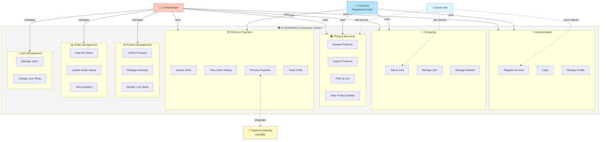

# PLAYARENA - Use Case Diagram

## Complete Use Case Diagram (Mermaid)

```mermaid
graph TB
    subgraph "PLAYARENA E-Commerce System"
        subgraph "Authentication & Account Management"
            UC1[Register Account]
            UC2[Login]
            UC3[Logout]
            UC4[View Profile]
            UC5[Change Password]
        end
        
        subgraph "Product Browsing & Discovery"
            UC6[Browse Products]
            UC7[Search Products]
            UC8[Filter Products]
            UC9[Sort Products]
            UC10[View Product Details]
        end
        
        subgraph "Shopping Cart & Wishlist"
            UC11[Add to Cart]
            UC12[View Cart]
            UC13[Update Cart Quantity]
            UC14[Remove from Cart]
            UC15[Add to Wishlist]
            UC16[View Wishlist]
            UC17[Remove from Wishlist]
        end
        
        subgraph "Order & Payment"
            UC18[Create Order]
            UC19[View Order History]
            UC20[View Order Details]
            UC21[Generate QR Payment]
            UC22[Confirm Payment]
            UC23[Track Order Status]
        end
        
        subgraph "Product Management - Admin"
            UC24[Create Product]
            UC25[Edit Product]
            UC26[Delete Product]
            UC27[Upload Product Image]
            UC28[Manage Stock]
            UC29[View Low Stock Alerts]
        end
        
        subgraph "Order Management - Admin"
            UC30[View All Orders]
            UC31[Update Order Status]
            UC32[View Order Analytics]
        end
        
        subgraph "User Management - Admin"
            UC33[View All Users]
            UC34[Change User Role]
            UC35[View User Activity]
        end
        
        subgraph "Dashboard & Reports - Admin"
            UC36[View Dashboard KPIs]
            UC37[View Sales Reports]
            UC38[View Inventory Reports]
        end
    end
    
    %% Actors
    Guest[👤 Guest User]
    Customer[👤 Customer]
    Admin[👨‍💼 Administrator]
    PaymentGateway[🏦 Payment Gateway]
    
    %% Guest User Use Cases
    Guest --> UC1
    Guest --> UC2
    Guest --> UC6
    Guest --> UC7
    Guest --> UC8
    Guest --> UC9
    Guest --> UC10
    Guest --> UC11
    Guest --> UC12
    Guest --> UC15
    Guest --> UC16
    
    %% Customer Use Cases (inherits Guest + authenticated features)
    Customer --> UC1
    Customer --> UC2
    Customer --> UC3
    Customer --> UC4
    Customer --> UC5
    Customer --> UC6
    Customer --> UC7
    Customer --> UC8
    Customer --> UC9
    Customer --> UC10
    Customer --> UC11
    Customer --> UC12
    Customer --> UC13
    Customer --> UC14
    Customer --> UC15
    Customer --> UC16
    Customer --> UC17
    Customer --> UC18
    Customer --> UC19
    Customer --> UC20
    Customer --> UC21
    Customer --> UC22
    Customer --> UC23
    
    %% Admin Use Cases (inherits Customer + admin features)
    Admin --> UC1
    Admin --> UC2
    Admin --> UC3
    Admin --> UC4
    Admin --> UC5
    Admin --> UC6
    Admin --> UC7
    Admin --> UC8
    Admin --> UC9
    Admin --> UC10
    Admin --> UC11
    Admin --> UC12
    Admin --> UC13
    Admin --> UC14
    Admin --> UC15
    Admin --> UC16
    Admin --> UC17
    Admin --> UC18
    Admin --> UC19
    Admin --> UC20
    Admin --> UC21
    Admin --> UC22
    Admin --> UC23
    Admin --> UC24
    Admin --> UC25
    Admin --> UC26
    Admin --> UC27
    Admin --> UC28
    Admin --> UC29
    Admin --> UC30
    Admin --> UC31
    Admin --> UC32
    Admin --> UC33
    Admin --> UC34
    Admin --> UC35
    Admin --> UC36
    Admin --> UC37
    Admin --> UC38
    
    %% External System
    UC22 -.->|validates| PaymentGateway
    PaymentGateway -.->|confirms| UC22
    
    %% Relationships (includes, extends)
    UC18 -.->|includes| UC2
    UC18 -.->|includes| UC21
    UC22 -.->|extends| UC18
    UC24 -.->|includes| UC27
    UC25 -.->|includes| UC27
```

---

## Simplified Use Case Diagram (Better Visualization)

---

## Actor Descriptions

### 1. 👤 Guest User (Unauthenticated)
**Description**: Anonymous visitor to the website

**Capabilities**:
- Browse product catalog
- Search and filter products
- View product details
- Add items to cart (stored in browser)
- Add items to wishlist (stored in browser)
- Register for an account
- Login to existing account

**Limitations**:
- ❌ Cannot checkout/create orders
- ❌ Cannot view order history
- ❌ Cart/wishlist not persisted across devices
- ❌ No access to profile

---

### 2. 👤 Customer (Registered User)
**Description**: Authenticated user with customer role

**Inherits**: All Guest User capabilities

**Additional Capabilities**:
- ✅ Create orders and checkout
- ✅ Process payments
- ✅ View order history
- ✅ Track order status
- ✅ View and edit profile
- ✅ Change password
- ✅ Logout

**Limitations**:
- ❌ Cannot access admin features
- ❌ Can only view own orders
- ❌ Cannot manage products or users

---

### 3. 👨‍💼 Administrator
**Description**: Authenticated user with admin role

**Inherits**: All Customer capabilities

**Additional Capabilities**:
- ✅ **Product Management**:
  - Create new products
  - Edit existing products
  - Delete products
  - Upload product images
  - Manage stock levels
  - View low stock alerts

- ✅ **Order Management**:
  - View all customer orders
  - Update order status
  - View order analytics
  - Access customer order details

- ✅ **User Management**:
  - View all registered users
  - Change user roles (user ↔ admin)
  - View user activity

- ✅ **Dashboard & Reports**:
  - View KPIs (total products, categories, low stock, pending orders)
  - View sales reports
  - View inventory reports
  - Monitor system activity

---

### 4. 🏦 Payment Gateway (External System)
**Description**: Third-party payment processing system (VietQR)

**Responsibilities**:
- Generate QR codes for payments
- Process bank transfers
- Validate payment transactions
- Send payment confirmations (webhook)

**Integration Points**:
- Receives payment requests from system
- Returns QR code data
- Confirms payment status

---

## Use Case Descriptions

### Authentication & Account Management

#### UC1: Register Account
- **Actor**: Guest User
- **Description**: Create a new customer account
- **Preconditions**: User is not logged in
- **Main Flow**:
  1. User navigates to registration page
  2. User enters email and password
  3. System validates input (email format, password strength)
  4. System checks if email already exists
  5. System hashes password with bcrypt
  6. System creates user with 'user' role
  7. System displays success message
- **Postconditions**: User account created, can now login
- **Alternative Flows**:
  - Email already exists → Show error
  - Passwords don't match → Show error
  - Weak password → Show strength indicator

#### UC2: Login
- **Actor**: Guest User, Customer, Admin
- **Description**: Authenticate and access account
- **Preconditions**: User has registered account
- **Main Flow**:
  1. User enters email and password
  2. System validates credentials
  3. System generates JWT token
  4. System stores token in browser
  5. System redirects based on role (admin → admin.html, user → index.html)
- **Postconditions**: User authenticated, token stored
- **Alternative Flows**:
  - Invalid credentials → Show error
  - Account not found → Show error

#### UC3: Logout
- **Actor**: Customer, Admin
- **Description**: End user session
- **Main Flow**:
  1. User clicks logout
  2. System removes token from browser
  3. System redirects to login page
- **Postconditions**: User logged out

#### UC4: View Profile
- **Actor**: Customer, Admin
- **Description**: View account information
- **Preconditions**: User is logged in
- **Main Flow**:
  1. User navigates to profile page
  2. System fetches user data via JWT token
  3. System displays email and role
- **Postconditions**: Profile displayed

#### UC5: Change Password
- **Actor**: Customer, Admin
- **Description**: Update account password
- **Preconditions**: User is logged in
- **Main Flow**:
  1. User enters current password and new password
  2. System verifies current password
  3. System hashes new password
  4. System updates password in database
  5. System displays success message
- **Postconditions**: Password updated
- **Alternative Flows**:
  - Current password incorrect → Show error

---

### Product Browsing & Discovery

#### UC6: Browse Products
- **Actor**: Guest, Customer, Admin
- **Description**: View product catalog
- **Main Flow**:
  1. User navigates to products page
  2. System fetches all products from database
  3. System displays products in grid layout
  4. User can see product images, names, prices, age ratings, piece counts
- **Postconditions**: Products displayed

#### UC7: Search Products
- **Actor**: Guest, Customer, Admin
- **Description**: Find products by keyword
- **Main Flow**:
  1. User enters search term
  2. System filters products by name match
  3. System displays matching products
- **Postconditions**: Filtered results displayed

#### UC8: Filter Products
- **Actor**: Guest, Customer, Admin
- **Description**: Filter products by criteria
- **Main Flow**:
  1. User selects filter (theme, stock status)
  2. System applies filter
  3. System displays filtered products
- **Postconditions**: Filtered products displayed

#### UC9: Sort Products
- **Actor**: Guest, Customer, Admin
- **Description**: Sort products by criteria
- **Main Flow**:
  1. User selects sort option (price low-high, high-low, newest)
  2. System sorts products
  3. System displays sorted products
- **Postconditions**: Sorted products displayed

#### UC10: View Product Details
- **Actor**: Guest, Customer, Admin
- **Description**: View detailed product information
- **Main Flow**:
  1. User clicks on product
  2. System displays product modal with full details
  3. User can see image, name, price, age, pieces, description
- **Postconditions**: Product details displayed

---

### Shopping Cart & Wishlist

#### UC11: Add to Cart
- **Actor**: Guest, Customer, Admin
- **Description**: Add product to shopping cart
- **Main Flow**:
  1. User clicks "Add to Cart" button
  2. System adds product to cart (localStorage)
  3. System updates cart badge count
  4. System shows confirmation message
- **Postconditions**: Product added to cart

#### UC12: View Cart
- **Actor**: Guest, Customer, Admin
- **Description**: View shopping cart contents
- **Main Flow**:
  1. User navigates to cart page
  2. System loads cart from localStorage
  3. System displays items with images, names, prices, quantities
  4. System calculates subtotal, tax (8%), shipping, total
  5. System shows free shipping if subtotal > $100
- **Postconditions**: Cart displayed with totals

#### UC13: Update Cart Quantity
- **Actor**: Customer, Admin
- **Description**: Change item quantity in cart
- **Main Flow**:
  1. User changes quantity
  2. System updates cart
  3. System recalculates totals
  4. System updates display
- **Postconditions**: Cart updated

#### UC14: Remove from Cart
- **Actor**: Customer, Admin
- **Description**: Remove item from cart
- **Main Flow**:
  1. User clicks remove button
  2. System removes item from cart
  3. System recalculates totals
  4. System updates display
- **Postconditions**: Item removed

#### UC15: Add to Wishlist
- **Actor**: Guest, Customer, Admin
- **Description**: Save product for later
- **Main Flow**:
  1. User clicks wishlist button
  2. System adds product to wishlist (localStorage)
  3. System updates wishlist icon
- **Postconditions**: Product added to wishlist

#### UC16: View Wishlist
- **Actor**: Guest, Customer, Admin
- **Description**: View saved products
- **Main Flow**:
  1. User navigates to wishlist page
  2. System loads wishlist from localStorage
  3. System displays saved products
- **Postconditions**: Wishlist displayed

#### UC17: Remove from Wishlist
- **Actor**: Customer, Admin
- **Description**: Remove product from wishlist
- **Main Flow**:
  1. User clicks remove button
  2. System removes product from wishlist
  3. System updates display
- **Postconditions**: Product removed

---

### Order & Payment

#### UC18: Create Order
- **Actor**: Customer, Admin
- **Description**: Place an order from cart
- **Preconditions**: User is logged in, cart has items
- **Main Flow**:
  1. User clicks "Checkout Securely"
  2. System validates user authentication
  3. System validates cart items
  4. System checks product stock availability
  5. System calculates totals (subtotal + 8% tax + shipping)
  6. System creates order record (status: pending)
  7. System creates order items (product snapshots)
  8. System generates transaction reference (TX-xxxxx)
  9. System creates payment transaction (status: pending)
  10. System generates QR code data
  11. System displays payment modal
- **Postconditions**: Order created, payment pending
- **Alternative Flows**:
  - Not logged in → Redirect to login
  - Cart empty → Show error
  - Insufficient stock → Show error
- **Includes**: UC2 (Login), UC21 (Generate QR Payment)

#### UC19: View Order History
- **Actor**: Customer, Admin
- **Description**: View past orders
- **Preconditions**: User is logged in
- **Main Flow**:
  1. User navigates to orders page
  2. System fetches user's orders
  3. System displays orders with date, status, total
- **Postconditions**: Order history displayed

#### UC20: View Order Details
- **Actor**: Customer, Admin
- **Description**: View specific order information
- **Preconditions**: User is logged in
- **Main Flow**:
  1. User clicks on order
  2. System fetches order details
  3. System displays items, quantities, prices, totals, status, payment info
- **Postconditions**: Order details displayed
- **Alternative Flows**:
  - User tries to view another user's order → Access denied (unless admin)

#### UC21: Generate QR Payment
- **Actor**: System (automated)
- **Description**: Generate QR code for payment
- **Preconditions**: Order created
- **Main Flow**:
  1. System generates unique transaction reference
  2. System calculates VND amount (USD × 25,000)
  3. System creates QR payload (Base64 encoded)
  4. System generates VietQR URL with bank details
  5. System sets expiration time (30 minutes)
  6. System stores QR data in payment transaction
- **Postconditions**: QR code generated and displayed

#### UC22: Confirm Payment
- **Actor**: Customer, Admin
- **Description**: Confirm payment has been made
- **Preconditions**: Order created, QR displayed, user has transferred money
- **Main Flow**:
  1. User scans QR code with banking app
  2. User transfers money via bank
  3. User clicks "I've Transferred" button
  4. System validates transaction reference
  5. System checks payment status (must be 'pending')
  6. System verifies product stock availability
  7. System updates payment status to 'paid'
  8. System updates order status to 'confirmed'
  9. System decrements product stock
  10. System clears cart
  11. System displays success message
- **Postconditions**: Payment confirmed, order confirmed, stock decremented
- **Alternative Flows**:
  - Transaction not found → Show error
  - Already paid → Show success
  - Insufficient stock → Show error, rollback
- **Extends**: UC18 (Create Order)
- **Integrates**: Payment Gateway (VietQR)

#### UC23: Track Order Status
- **Actor**: Customer, Admin
- **Description**: Monitor order progress
- **Main Flow**:
  1. User views order details
  2. System displays current status
  3. Status can be: pending, processing, confirmed, shipped, completed, cancelled
- **Postconditions**: Order status displayed

---

### Product Management (Admin Only)

#### UC24: Create Product
- **Actor**: Admin
- **Description**: Add new product to catalog
- **Preconditions**: User is logged in as admin
- **Main Flow**:
  1. Admin clicks "Add Set" button
  2. Admin enters product details (name, price, stock, age, pieces, theme)
  3. Admin uploads product image
  4. System validates input
  5. System saves image to uploads folder
  6. System creates product record
  7. System displays success message
- **Postconditions**: Product created
- **Includes**: UC27 (Upload Product Image)

#### UC25: Edit Product
- **Actor**: Admin
- **Description**: Update existing product
- **Preconditions**: User is logged in as admin
- **Main Flow**:
  1. Admin clicks "Edit" button on product
  2. System loads product data into form
  3. Admin modifies details
  4. Admin optionally uploads new image
  5. System validates input
  6. System updates product record
  7. System displays success message
- **Postconditions**: Product updated
- **Includes**: UC27 (Upload Product Image)

#### UC26: Delete Product
- **Actor**: Admin
- **Description**: Remove product from catalog
- **Preconditions**: User is logged in as admin
- **Main Flow**:
  1. Admin clicks "Delete" button
  2. System shows confirmation dialog
  3. Admin confirms deletion
  4. System deletes product record
  5. System displays success message
- **Postconditions**: Product deleted
- **Note**: Historical orders retain product snapshot

#### UC27: Upload Product Image
- **Actor**: Admin
- **Description**: Upload product image file
- **Preconditions**: Creating or editing product
- **Main Flow**:
  1. Admin selects image file
  2. System validates file type (image only)
  3. System uploads file to server
  4. System saves file path to database
  5. System displays image preview
- **Postconditions**: Image uploaded and linked to product

#### UC28: Manage Stock
- **Actor**: Admin
- **Description**: Update product inventory
- **Main Flow**:
  1. Admin edits product
  2. Admin updates stock quantity
  3. System saves new stock level
- **Postconditions**: Stock updated
- **Note**: Stock auto-decrements on payment confirmation

#### UC29: View Low Stock Alerts
- **Actor**: Admin
- **Description**: Monitor products with low inventory
- **Main Flow**:
  1. Admin views dashboard
  2. System displays products with stock ≤ 10
  3. System shows low stock count in KPI
  4. System highlights low stock products in red
- **Postconditions**: Low stock products identified

---

### Order Management (Admin Only)

#### UC30: View All Orders
- **Actor**: Admin
- **Description**: View orders from all customers
- **Preconditions**: User is logged in as admin
- **Main Flow**:
  1. Admin navigates to Orders tab
  2. System fetches all orders
  3. System displays orders with customer email, date, status, total
- **Postconditions**: All orders displayed

#### UC31: Update Order Status
- **Actor**: Admin
- **Description**: Change order status
- **Preconditions**: User is logged in as admin
- **Main Flow**:
  1. Admin selects new status from dropdown
  2. System validates status transition
  3. System updates order status
  4. System displays success message
- **Postconditions**: Order status updated
- **Valid Statuses**: pending, processing, confirmed, shipped, completed, cancelled

#### UC32: View Order Analytics
- **Actor**: Admin
- **Description**: View order statistics
- **Main Flow**:
  1. Admin views dashboard
  2. System displays pending orders count
  3. System shows recent order activity
- **Postconditions**: Analytics displayed

---

### User Management (Admin Only)

#### UC33: View All Users
- **Actor**: Admin
- **Description**: View registered users
- **Preconditions**: User is logged in as admin
- **Main Flow**:
  1. Admin navigates to Customers tab
  2. System fetches all users
  3. System displays users with ID, email, role
- **Postconditions**: All users displayed

#### UC34: Change User Role
- **Actor**: Admin
- **Description**: Promote/demote user
- **Preconditions**: User is logged in as admin
- **Main Flow**:
  1. Admin selects new role from dropdown (user/admin)
  2. System updates user role
  3. System displays success message
- **Postconditions**: User role updated

#### UC35: View User Activity
- **Actor**: Admin
- **Description**: Monitor user actions
- **Main Flow**:
  1. Admin views dashboard
  2. System displays recent customer activity
  3. System shows order creation events
- **Postconditions**: Activity displayed

---

### Dashboard & Reports (Admin Only)

#### UC36: View Dashboard KPIs
- **Actor**: Admin
- **Description**: View key performance indicators
- **Main Flow**:
  1. Admin views dashboard
  2. System displays:
     - Total products count
     - Categories count
     - Low stock count
     - Pending orders count
- **Postconditions**: KPIs displayed

#### UC37: View Sales Reports
- **Actor**: Admin
- **Description**: View sales statistics
- **Main Flow**:
  1. Admin views dashboard
  2. System calculates sales metrics
  3. System displays revenue, order counts
- **Postconditions**: Sales reports displayed

#### UC38: View Inventory Reports
- **Actor**: Admin
- **Description**: View inventory statistics
- **Main Flow**:
  1. Admin views inventory tab
  2. System displays stock levels
  3. System highlights low stock items
  4. System shows stock by category
- **Postconditions**: Inventory reports displayed

---

## Use Case Relationships

### Include Relationships
- **UC18 (Create Order)** includes **UC2 (Login)**: Must be logged in to create order
- **UC18 (Create Order)** includes **UC21 (Generate QR Payment)**: Order creation triggers payment generation
- **UC24 (Create Product)** includes **UC27 (Upload Product Image)**: Creating product may include image upload
- **UC25 (Edit Product)** includes **UC27 (Upload Product Image)**: Editing product may include image upload

### Extend Relationships
- **UC22 (Confirm Payment)** extends **UC18 (Create Order)**: Payment confirmation is optional extension of order creation
- **UC23 (Track Order Status)** extends **UC20 (View Order Details)**: Status tracking extends order viewing

### Generalization (Inheritance)
- **Customer** inherits all **Guest** capabilities
- **Admin** inherits all **Customer** capabilities

---

## System Boundaries

### Public Access (No Authentication Required)
- Browse products
- Search/filter/sort
- View product details
- Add to cart (localStorage)
- Add to wishlist (localStorage)
- Register
- Login

### Authenticated Access (Login Required)
- Create orders
- Process payments
- View order history
- View profile
- Change password

### Admin Access (Admin Role Required)
- All authenticated features
- Product CRUD operations
- Order management
- User management
- Dashboard and reports

---

## External System Integration

### Payment Gateway (VietQR)
**Integration Type**: REST API / QR Code Generation

**Interactions**:
1. **Generate QR Code**:
   - System → Payment Gateway: Request QR with amount, account, reference
   - Payment Gateway → System: Return QR image URL

2. **Confirm Payment** (Future Enhancement):
   - Payment Gateway → System: Webhook with payment status
   - System → Payment Gateway: Acknowledge receipt

**Current Implementation**: Mock integration with VietQR image API

---

## Use Case Priority Matrix

### High Priority (MVP)
- ✅ UC1: Register Account
- ✅ UC2: Login
- ✅ UC6: Browse Products
- ✅ UC11: Add to Cart
- ✅ UC12: View Cart
- ✅ UC18: Create Order
- ✅ UC21: Generate QR Payment
- ✅ UC22: Confirm Payment
- ✅ UC24: Create Product (Admin)
- ✅ UC30: View All Orders (Admin)

### Medium Priority
- ✅ UC7: Search Products
- ✅ UC8: Filter Products
- ✅ UC19: View Order History
- ✅ UC25: Edit Product (Admin)
- ✅ UC26: Delete Product (Admin)
- ✅ UC31: Update Order Status (Admin)
- ✅ UC33: View All Users (Admin)

### Low Priority (Nice to Have)
- ✅ UC5: Change Password
- ✅ UC15: Add to Wishlist
- ✅ UC29: View Low Stock Alerts
- ✅ UC34: Change User Role
- ✅ UC36: View Dashboard KPIs

### Future Enhancements
- ⏳ Email notifications
- ⏳ Password reset
- ⏳ Product reviews/ratings
- ⏳ Advanced analytics
- ⏳ Shipping address management
- ⏳ Multiple payment methods
- ⏳ Refund processing
- ⏳ Promotional codes/discounts

---

## Summary Statistics

| Category | Count |
|----------|-------|
| **Total Use Cases** | 38 |
| **Actors** | 4 (3 human, 1 system) |
| **Public Use Cases** | 11 |
| **Authenticated Use Cases** | 12 |
| **Admin Use Cases** | 15 |
| **Include Relationships** | 4 |
| **Extend Relationships** | 2 |
| **External Integrations** | 1 |

---

**Document Version**: 1.0  
**Last Updated**: 2026-05-14  
**System**: PLAYARENA E-Commerce MIS  
**Status**: Production Ready ✅
