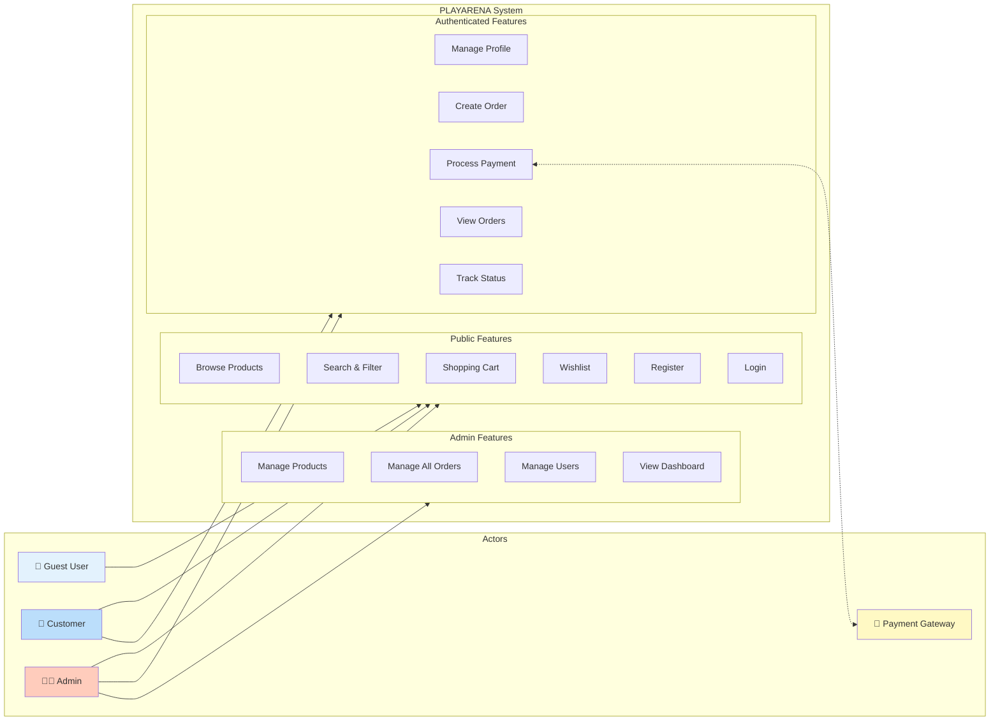
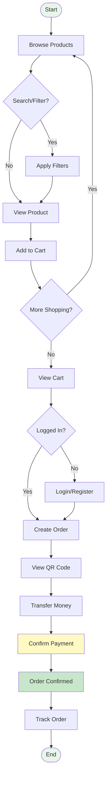
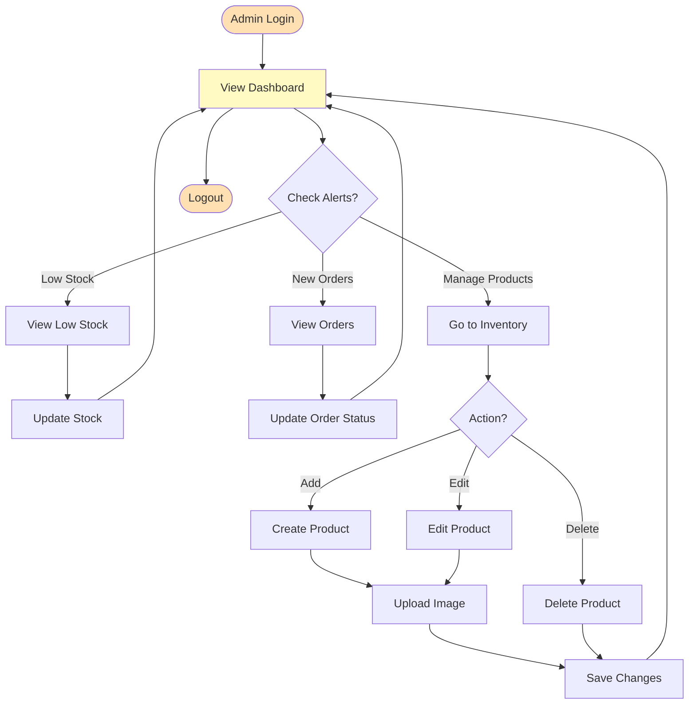
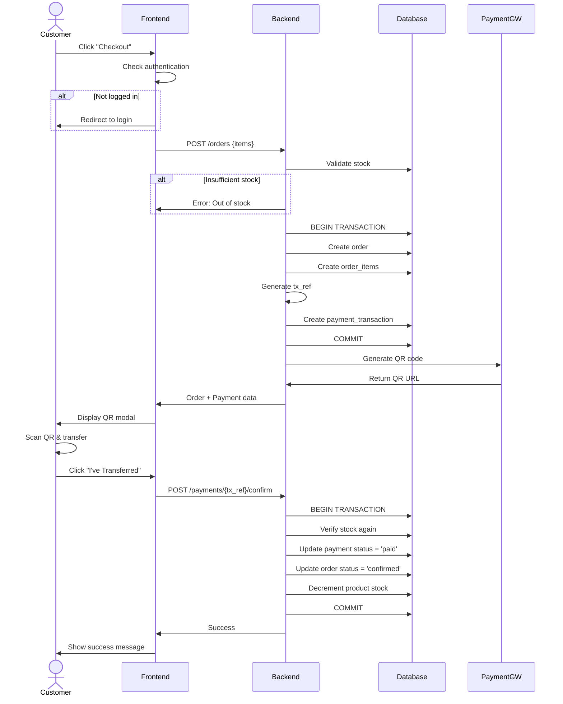

# PLAYARENA - Use Case Diagram Summary

## Quick Visual Reference

### Simplified Actor-Use Case Diagram



---

## Actor Capabilities Matrix

| Use Case | Guest | Customer | Admin |
|----------|:-----:|:--------:|:-----:|
| **Authentication & Account** |
| Register Account | ✅ | ✅ | ✅ |
| Login | ✅ | ✅ | ✅ |
| Logout | ❌ | ✅ | ✅ |
| View Profile | ❌ | ✅ | ✅ |
| Change Password | ❌ | ✅ | ✅ |
| **Product Browsing** |
| Browse Products | ✅ | ✅ | ✅ |
| Search Products | ✅ | ✅ | ✅ |
| Filter & Sort | ✅ | ✅ | ✅ |
| View Product Details | ✅ | ✅ | ✅ |
| **Shopping** |
| Add to Cart | ✅ | ✅ | ✅ |
| View Cart | ✅ | ✅ | ✅ |
| Manage Cart | ❌ | ✅ | ✅ |
| Add to Wishlist | ✅ | ✅ | ✅ |
| Manage Wishlist | ❌ | ✅ | ✅ |
| **Orders & Payment** |
| Create Order | ❌ | ✅ | ✅ |
| Process Payment | ❌ | ✅ | ✅ |
| View Order History | ❌ | ✅ | ✅ |
| Track Order Status | ❌ | ✅ | ✅ |
| **Product Management** |
| Create Product | ❌ | ❌ | ✅ |
| Edit Product | ❌ | ❌ | ✅ |
| Delete Product | ❌ | ❌ | ✅ |
| Manage Stock | ❌ | ❌ | ✅ |
| View Low Stock | ❌ | ❌ | ✅ |
| **Order Management** |
| View All Orders | ❌ | ❌ | ✅ |
| Update Order Status | ❌ | ❌ | ✅ |
| View Analytics | ❌ | ❌ | ✅ |
| **User Management** |
| View All Users | ❌ | ❌ | ✅ |
| Change User Roles | ❌ | ❌ | ✅ |
| **Dashboard** |
| View KPIs | ❌ | ❌ | ✅ |
| View Reports | ❌ | ❌ | ✅ |

---

## Use Case Categories

### 🔐 Authentication & Account Management (5 use cases)
1. Register Account
2. Login
3. Logout
4. View Profile
5. Change Password

### 🛍️ Product Browsing & Discovery (5 use cases)
6. Browse Products
7. Search Products
8. Filter Products
9. Sort Products
10. View Product Details

### 🛒 Shopping Cart & Wishlist (7 use cases)
11. Add to Cart
12. View Cart
13. Update Cart Quantity
14. Remove from Cart
15. Add to Wishlist
16. View Wishlist
17. Remove from Wishlist

### 📦 Order & Payment (6 use cases)
18. Create Order
19. View Order History
20. View Order Details
21. Generate QR Payment
22. Confirm Payment
23. Track Order Status

### ⚙️ Product Management - Admin (6 use cases)
24. Create Product
25. Edit Product
26. Delete Product
27. Upload Product Image
28. Manage Stock
29. View Low Stock Alerts

### 📊 Order Management - Admin (3 use cases)
30. View All Orders
31. Update Order Status
32. View Order Analytics

### 👥 User Management - Admin (3 use cases)
33. View All Users
34. Change User Role
35. View User Activity

### 📈 Dashboard & Reports - Admin (3 use cases)
36. View Dashboard KPIs
37. View Sales Reports
38. View Inventory Reports

---

## User Journey Flows

### 🛍️ Customer Shopping Journey



### 👨‍💼 Admin Product Management Journey



---

## Key Use Case Relationships

### Include Relationships (Mandatory)
```
Create Order (UC18)
    ├── includes → Login (UC2)
    └── includes → Generate QR Payment (UC21)

Create Product (UC24)
    └── includes → Upload Product Image (UC27)

Edit Product (UC25)
    └── includes → Upload Product Image (UC27)
```

### Extend Relationships (Optional)
```
Create Order (UC18)
    └── extends ← Confirm Payment (UC22)

View Order Details (UC20)
    └── extends ← Track Order Status (UC23)
```

### Actor Inheritance
```
Guest User
    └── inherits → Customer
        └── inherits → Admin
```

---

## Critical Use Case Flows

### 🔥 UC18: Create Order (Most Complex)



---

## Use Case Statistics

### By Actor
- **Guest User**: 11 use cases (29%)
- **Customer**: 23 use cases (61%)
- **Admin**: 38 use cases (100%)
- **Payment Gateway**: 1 integration point

### By Category
- **Public Access**: 11 use cases (29%)
- **Authenticated**: 12 use cases (32%)
- **Admin Only**: 15 use cases (39%)

### By Priority
- **High Priority (MVP)**: 10 use cases ✅
- **Medium Priority**: 8 use cases ✅
- **Low Priority**: 6 use cases ✅
- **Future Enhancements**: 8+ planned ⏳

---

## Access Control Summary

### Public (No Auth Required)
```
✅ Browse, Search, Filter, Sort Products
✅ View Product Details
✅ Add to Cart (localStorage)
✅ Add to Wishlist (localStorage)
✅ Register & Login
```

### Authenticated (Login Required)
```
✅ All Public features
✅ Create Orders
✅ Process Payments
✅ View Order History
✅ Manage Profile
✅ Persistent Cart & Wishlist
```

### Admin (Admin Role Required)
```
✅ All Authenticated features
✅ Product CRUD operations
✅ Order management (all orders)
✅ User management
✅ Dashboard & Analytics
```

---

## External System Integration

### Payment Gateway (VietQR)
**Type**: REST API / QR Code Generation

**Use Cases Involved**:
- UC21: Generate QR Payment
- UC22: Confirm Payment

**Integration Flow**:
```
System → Payment Gateway: Generate QR (amount, account, reference)
Payment Gateway → System: QR image URL
Customer → Bank App: Scan & transfer
Bank → Payment Gateway: Process transfer
Payment Gateway → System: Webhook (future)
System → Database: Confirm payment
```

---

## Quick Reference: Who Can Do What?

### Everyone Can:
- 👀 Browse and search products
- 🛒 Add items to cart
- ❤️ Add items to wishlist
- 📝 Register an account

### Customers Can Also:
- 🔐 Login and manage profile
- 💳 Checkout and pay
- 📦 View their order history
- 🔍 Track their orders

### Admins Can Also:
- ➕ Create/edit/delete products
- 📊 View all orders and users
- ⚙️ Manage order statuses
- 👥 Change user roles
- 📈 View analytics dashboard

---

## Total System Capabilities

| Metric | Count |
|--------|------:|
| **Total Use Cases** | 38 |
| **Human Actors** | 3 |
| **External Systems** | 1 |
| **Public Features** | 11 |
| **Auth Features** | 12 |
| **Admin Features** | 15 |
| **Include Relations** | 4 |
| **Extend Relations** | 2 |

---

**Quick Tip**: For detailed use case descriptions, see `USECASE_DIAGRAM.md`

**Document Version**: 1.0  
**System**: PLAYARENA E-Commerce MIS  
**Status**: Complete ✅
