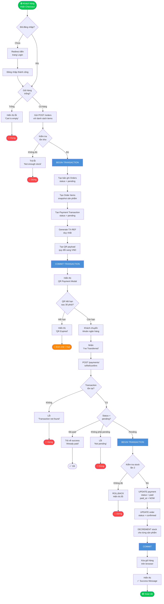
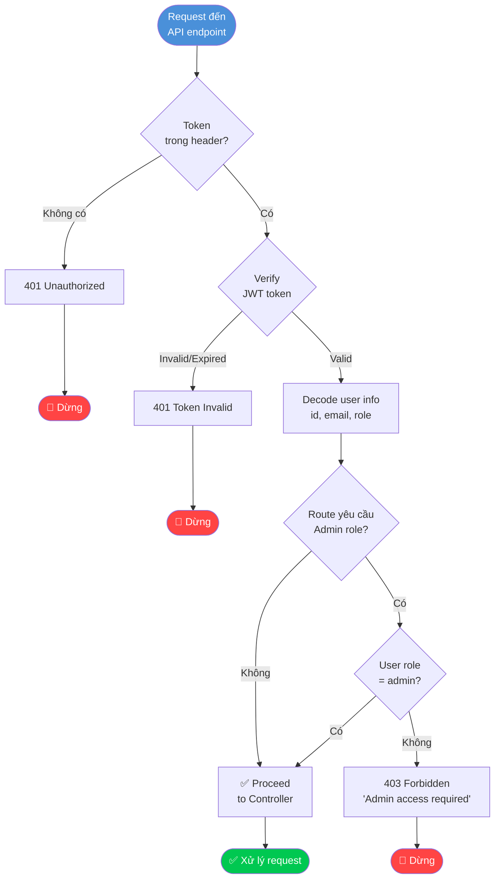
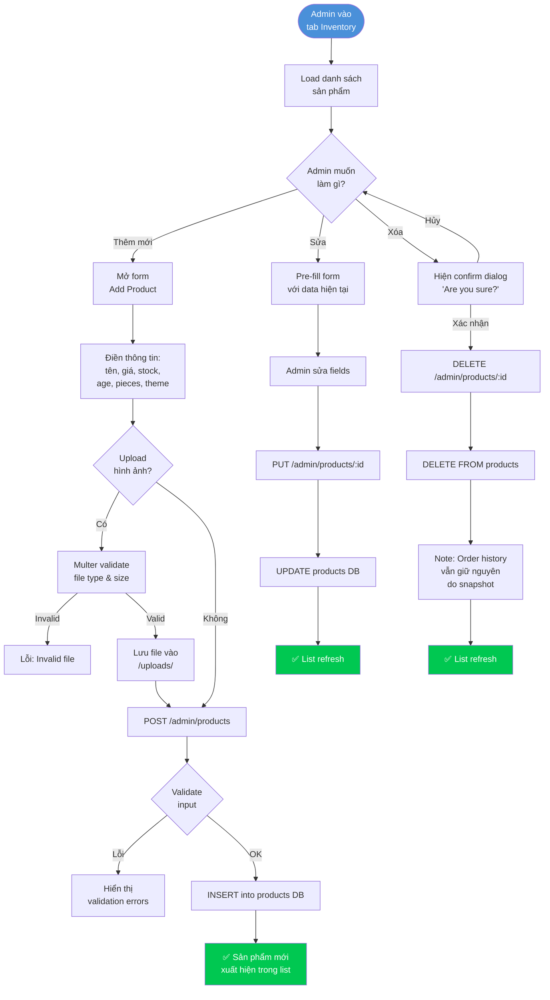
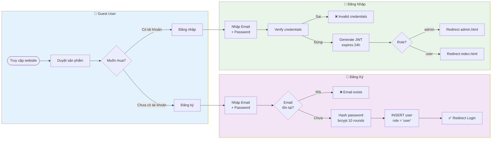
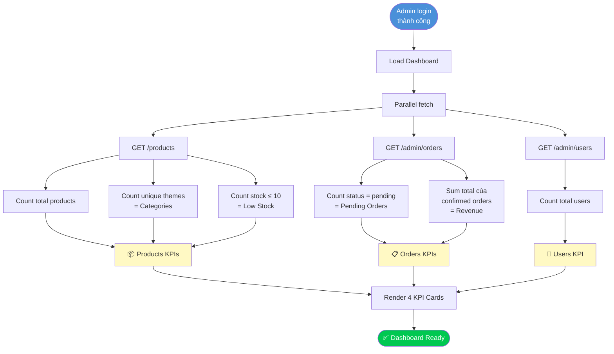

# Process Flow & BPMN Diagrams
**Project:** PLAYARENA – LEGO E-Commerce MIS  
**Version:** 1.0  
**Author:** [Your Name]  
**Date:** August 2026

> Tài liệu này mô tả các luồng nghiệp vụ chính của hệ thống PLAYARENA dưới dạng BPMN process flow, bao gồm As-Is (nếu có) và To-Be (hệ thống hiện tại).

---

## FLOW 1: Luồng Đặt Hàng & Thanh Toán (Order-to-Payment)

### Mô tả
Luồng quan trọng nhất của hệ thống, từ khi khách hàng bắt đầu checkout đến khi đơn hàng được xác nhận và tồn kho được cập nhật.

### BPMN Diagram



### Key Business Rules trong Flow này
| Bước | Business Rule |
|------|--------------|
| Tính tổng | Subtotal + Tax(8%) + Shipping($10, free >$100) |
| QR expiry | Hết hạn sau 30 phút |
| VND conversion | 1 USD × 25,000 = VND |
| Double check stock | Kiểm tra tồn kho 2 lần (khi tạo đơn & khi xác nhận) |
| Atomic transaction | Tất cả bước trong 1 DB transaction |
| Snapshot | Order items lưu giá/tên tại thời điểm đặt hàng |

---

## FLOW 2: Luồng Xác Thực & Phân Quyền (Authentication & Authorization)



### Protected Routes
| Route Pattern | Yêu cầu |
|--------------|---------|
| `GET /products` | Public (không cần token) |
| `POST /orders` | Authenticated (any role) |
| `GET /orders` | Authenticated (own data only) |
| `GET /admin/*` | Admin role required |
| `POST /admin/products` | Admin role required |
| `PATCH /admin/orders/:id/status` | Admin role required |

---

## FLOW 3: Luồng Quản Lý Sản Phẩm - Admin (Product Management)



---

## FLOW 4: Luồng Đăng Ký & Đăng Nhập (Registration & Login)

### As-Is Process (Trước khi có hệ thống)
```
Khách hàng muốn mua → Gọi điện / nhắn tin thủ công → Admin xử lý thủ công
→ Không có tracking → Không có order history → Dễ xảy ra sai sót
```

### To-Be Process (Hệ thống PLAYARENA)



---

## FLOW 5: Admin Dashboard – KPI Calculation



---

## Summary – Danh sách Processes

| Flow | Tên | Actors | Complexity |
|------|-----|--------|-----------|
| FLOW 1 | Order-to-Payment | Customer, System, Payment GW | ⭐⭐⭐ High |
| FLOW 2 | Authentication & Authorization | All users, System | ⭐⭐ Medium |
| FLOW 3 | Product Management (Admin) | Admin, System | ⭐⭐ Medium |
| FLOW 4 | Registration & Login | Guest, Customer, System | ⭐ Low |
| FLOW 5 | KPI Dashboard Calculation | Admin, System | ⭐ Low |

---

## Process Metrics

| Metric | Value |
|--------|-------|
| Tổng số luồng nghiệp vụ chính | 5 |
| Tổng số decision points (gateways) | 18+ |
| Critical path (Order-to-Payment) | 12 bước chính |
| Failure points được xử lý | 8 loại lỗi |
| External system integrations | 1 (VietQR) |

---

*Document Version: 1.0 | Last Updated: August 2026*
